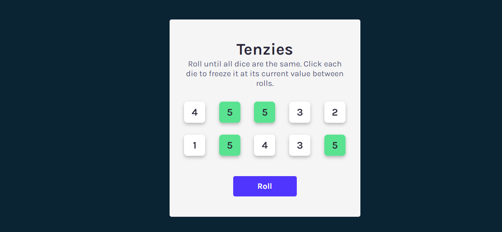

# Tenzies Game

This is a redo of the tenzies game project that is taught in [Scrimba's learn React for free](https://scrimba.com/learn/learnreact) course with my own added features 

## Table of contents

- [Overview](#overview)
  - [The challenge](#the-challenge)
  - [Screenshot](#screenshot)
  - [Links](#links)
- [My process](#my-process)
  - [Built with](#built-with)
  - [What I learned](#what-i-learned)
  - [Continued development](#continued-development)
  - [Useful resources](#useful-resources)
- [Author](#author)

## Overview

### The challenge

Tenzies is a 10-dice game and you win when you are able to roll your dice till all dice have the same number, in the shortest possible time.

Players should be able to:

- Roll the dice using a roll button
- Hold die in place when it is clicked
- See a confetti when they win the game

### Screenshot

### Links
- [Solution URL](https://github.com/mbonamensa/imb_tenzies-game)
- [Live Site URL](https://imb-tenzies-game.netlify.app/)

## My process

### Built with

- React
- React-confetti
- React-hook (useWindowSize)
- React-timer-hook (useStopWatch)
- LocalStorage
- SASS

### What I learned

useEffect in React can be used to keep two or more states in sync. This is what was used to check if all the dice were the same and had the same value.

### Continued development

I am looking to add the following features to the game on my own to practice and gain more experience.

- [x] An overlay screen that displays score details
- [x] Time taken to complete game
- [x] Number of rolls made to complete game
- [x] Best number of rolls, i.e the least number of rolls made to win
- [x] Best time, i.e the leat time taken to win

##### What I learned after adding new features
In my bid to add a timer, I came accros the react-timer-hook package that helps implement stop watches, timers and dates. This is what I used to track the time taken to win the game. I also came accross the useWindowSize hook that helped with making the confetti that plays on the screen after a win responsive.

## Useful resources
- [Emoji Unicode Reference](https://www.w3schools.com/charsets/ref_emoji.asp)
- [react-timer-hook](https://github.com/amrlabib/react-timer-hook)
- [useWindowSize](https://github.com/jaredLunde/react-hook/tree/master/packages/window-size)
- [react-confetti](https://github.com/alampros/react-confetti)
## Author

- Website - [Maame Yaa Serwaa Bona-Mensa](https://mbonamensa.netlify.app)
- Twitter - [@mys_bm](https://www.twitter.com/mys_mb)